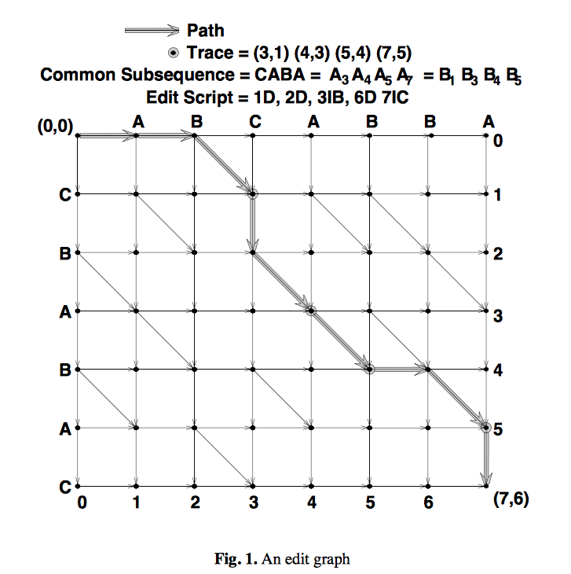
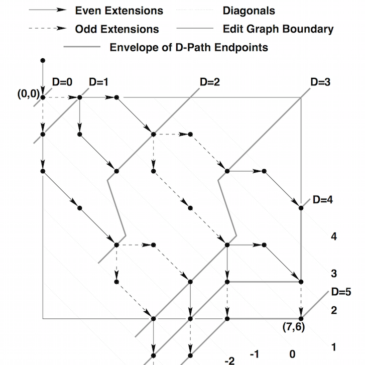

# Comparator

This application provides ability to find Shortest Edit Script. Code base is using Clojure 1.7.0

## Algorithm

Algorithm used in this app is a greedy diff algorithm, as described by Eugene W. Myers in his paper,  ["An O(ND) Difference Algorithm and Its Variations"](http://xmailserver.org/diff2.pdf). It was published in the journal "Algorithmica" in November 1986.

### Definitions

#### Shortest edit script

Myers proved that solving the problem of the Shortest Edit Script can be reduced to just finding the shortest path in the editor graph. There are 3 types of commands int this script: 

* change  
* removal 
* addition 

#### Editor graph

The editor graph is a graph where elements of first collection are on x-axis, elements of second collection are on y axis, as you see on picture below:

Every path from top left to right bottom to right down can be translated as an editor script transforming first collection to another in following way:

 - moving right removes an element from x axis
 - moving down adds an element to y axis
 - we can combine moving right and down into substitution of element
 - moving diagonal means that we don't need to change anything
 
#### d-path

D-path is a path with d right and left moves. Please note that diagonals move are not counted.

#### d-envelope

D-Envelope is a line which is drawn by all furthest d-path

### How it works?

Myers figured out several things in his work, that optimise algorithm:
1. algorithm is greedy - we are going to analyze firstly paths with 1-change allowed, then with 2-changes, etc. until the bottom right corner of graph will be reached.
2. lets enumerate diagonals - the 0 comes out from (0,0) below are enumerated them -1,-2,-3, above 1,2,3. In such case
 for path with k-changes we have only to analyse diagonals from (-k,+k). Moreover only every second diagonal needs to be analyzed (because extending
 path with a change than the end of path will be on diagonal with number 1 less (or more) than the original one.
 
 

Current implementation is a functional one - a bit different than imperative approach. We are using always previous d-envelope to generate next one, 
without need of manually manage number of diagonals and differences in for-loops. 

## Performance considerations

### Complexity

The algorithm itself works in O(ND) where N is sum of sizes of lists being compared and D is the number of modifications (both in terms of computation and memory). The path is transformed to editor script in linear time time.

### Performance tests

There are suite of performance tests created using [scala meter](https://scalameter.github.io). It provides nice option for regression test to be setup on CI if necessary. Benchmark tests can be run:
    
    ./activator benchmark:test

Results are stored by default in tmp/report/index.html - they can be attached to CI server and configure as regression test if it would be needed. For doing that follow instructions on [scala meter page](http://scalameter.github.io/home/gettingstarted/0.7/regressions/index.html)

## Installation

Download from http://example.com/FIXME.

## Usage

FIXME: explanation

    $ java -jar comparator-0.1.0-standalone.jar [args]

## Options

FIXME: listing of options this app accepts.

## Examples

...

### Bugs

...

### Any Other Sections
### That You Think
### Might be Useful

## License

Copyright © 2015 FIXME

Distributed under the Eclipse Public License either version 1.0 or (at
your option) any later version.
